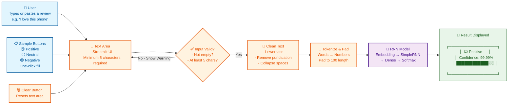

# SentimentFlow AI 🎭

A machine learning web application that classifies product/movie reviews into **Positive 😊**, **Neutral 😐**, or **Negative 😞** sentiments using a Recurrent Neural Network (SimpleRNN). Built with TensorFlow/Keras and served via Streamlit.

---

## Project Flow Diagram

```mermaid
flowchart TB
    classDef input fill:#e1f5fe,stroke:#01579b,stroke-width:2px,color:#01579b
    classDef process fill:#fff3e0,stroke:#e65100,stroke-width:2px,color:#e65100
    classDef model fill:#f3e5f5,stroke:#4a148c,stroke-width:2px,color:#4a148c
    classDef output fill:#e8f5e9,stroke:#1b5e20,stroke-width:2px,color:#1b5e20
    classDef data fill:#fce4ec,stroke:#880e4f,stroke-width:2px,color:#880e4f
    classDef split fill:#fff8e1,stroke:#f57f17,stroke-width:2px,color:#f57f17
    classDef ui fill:#e0f2f1,stroke:#00695c,stroke-width:2px,color:#00695c
    classDef epoch fill:#ede7f6,stroke:#4527a0,stroke-width:1px,color:#4527a0

    subgraph DATA_GEN["1. Data Generation - generate_dataset.py"]
        direction TB
        P_TEMPLATES["15 Positive Templates
        'This product is amazing...'
        'I absolutely love this...'
        'Fantastic quality...'"]:::data
        N_TEMPLATES["12 Negative Templates
        'This is the worst product...'
        'I absolutely hate this...'
        'What a waste of money...'"]:::data
        NEU_TEMPLATES["15 Neutral Templates
        'The product arrived yesterday.'
        'The product is fine.'
        'This is an average product.'"]:::data
        CONT["Continuation Phrases
        40% chance to append
        'The build quality is superb.'
        'It stopped working...'"]:::process
        END["Ending Phrases
        30% chance to append
        'Worth every penny.'
        'I have no complaints.'"]:::process
        P_TEMPLATES --> COMBINE
        N_TEMPLATES --> COMBINE
        NEU_TEMPLATES --> COMBINE
        CONT --> COMBINE
        END --> COMBINE
        COMBINE["make_review()
        Randomly combines:
        starter + (cont?) + (end?)"]:::process
        DUPES["50 duplicates each of:
        3 sample reviews
        5 key positive phrases"]:::data
        COMBINE --> CSV
        DUPES --> CSV
        CSV[("dataset/sentiment_dataset.csv
        ~3400 labeled reviews
        Columns: text, sentiment")]:::data
    end

    subgraph TRAIN["2. Training Pipeline - train_model.py"]
        direction TB
        LOAD["Load CSV with Pandas"]:::process
        CLEAN["Clean Text
        clean_text()
        - lowercase
        - remove punctuation
        - collapse whitespace"]:::process
        TOKENIZE["Tokenize
        Keras Tokenizer
        num_words=10000
        oov_token='&lt;OOV&gt;'
        Each word → integer index"]:::process
        PAD_SEQ["Pad Sequences
        pad_sequences()
        max_len=100
        padding='post'
        truncating='post'
        Variable length → fixed 100"]:::process
        ENCODE["Encode Labels
        sklearn LabelEncoder
        Positive → 0
        Negative → 1
        Neutral → 2"]:::process
        SPLIT["Train / Test Split
        train_test_split()
        test_size=0.2 (20%)
        random_state=42
        stratify=labels
        ─────────────────
        Training Set: ~2720 reviews
        Test Set: ~680 reviews"]:::split
        CSV --> LOAD
        LOAD --> CLEAN
        CLEAN --> TOKENIZE
        TOKENIZE --> PAD_SEQ
        PAD_SEQ --> ENCODE
        ENCODE --> SPLIT
    end

    subgraph ARCH["3. Model Architecture - RNN"]
        direction TB
        EMB[("Embedding Layer
        vocab_size × 100
        Each word → 100-dim vector
        Similar words → similar vectors")]:::model
        RNN[("SimpleRNN Layer
        128 units
        Processes sequence step-by-step
        Maintains hidden state
        Final state = review encoding")]:::model
        DENSE64[("Dense Layer
        64 units, ReLU activation
        Fully connected
        Transforms 128 → 64 dim")]:::model
        OUTPUT[("Output Layer
        3 units, Softmax activation
        Produces probability distribution
        Positive | Negative | Neutral
        Sum of probabilities = 1.0")]:::model
        EMB --> RNN --> DENSE64 --> OUTPUT
    end

    subgraph LOOP["4. Training Loop - 50 Epochs"]
        direction LR
        E1["Epoch 1
        Loss: ~1.10
        Accuracy: ~55%"]:::epoch
        E2["Epoch 5
        Loss: ~0.30
        Accuracy: ~90%"]:::epoch
        E3["Epoch 10
        Loss: ~0.05
        Accuracy: ~99%"]:::epoch
        E4["Epoch 25
        Loss: ~0.001
        Accuracy: 100%"]:::epoch
        E5["Epoch 50
        Loss: ~0.00003
        Accuracy: 100%"]:::epoch
        LR_CALLBACK["ReduceLROnPlateau
        Monitors: val_loss
        If no improvement for 5 epochs:
        → factor=0.5 (halve LR)
        → min_lr=0.0001
        Helps model converge"]:::process
        E1 --> E2 --> E3 --> E4 --> E5
        E5 -.-> LR_CALLBACK
        LR_CALLBACK -.-> |"Adjusts learning rate"| E5
    end

    subgraph SAVE["5. Save Artifacts"]
        SAVE_MODEL[("model/rnn_model.h5
        Trained Keras model
        HDF5 format")]:::data
        SAVE_TOK[("model/tokenizer.pkl
        Fitted Tokenizer
        Word → index mapping")]:::data
        SAVE_ENC[("model/label_encoder.pkl
        Fitted LabelEncoder
        Label → integer mapping")]:::data
    end

    subgraph PREDICT["6. Prediction Pipeline - predict.py"]
        direction TB
        USER_INPUT["User Input
        'Fantastic quality, very impressed!'"]:::input
        CLEAN2["clean_text()
        lowercase + remove punctuation"]:::process
        TOK["tokenizer.texts_to_sequences()
        ['fantastic','quality','very','impressed']
        → [42, 156, 89, 231]"]:::process
        PAD["pad_sequences()
        [42, 156, 89, 231, 0, 0, 0, ...]
        → length 100"]:::process
        PRED["model.predict()
        Input: padded sequence (100,)
        Output: [0.99, 0.01, 0.00]
        → argmax: class 0"]:::model
        DECODE["label_encoder.inverse_transform([0])
        → 'Positive'
        confidence = 99.0%"]:::process
        USER_INPUT --> CLEAN2
        CLEAN2 --> TOK
        TOK --> PAD
        PAD --> PRED
        PRED --> DECODE
    end

    subgraph UI["7. Streamlit UI - app.py"]
        direction TB
        TEXT_AREA["Text Area
        User types or pastes review
        Min 5 characters required"]:::ui
        VALIDATE["Validate Input
        - Not empty?
        - At least 5 chars?"]:::ui
        SAMPLE_BTNS["Sample Review Buttons
        😊 Positive button
        😐 Neutral button
        😞 Negative button
        One-click fills text area"]:::ui
        PREDICT_BTN["🔮 Predict Button
        Calls predict_sentiment()"]:::ui
        CLEAR_BTN["🗑️ Clear Button
        Resets text area"]:::ui
        DISPLAY["Display Results
        ┌──────────┐ ┌──────────────┐
        │ Positive 😊 │ │   99.99%    │
        │ Prediction│ │ ████████░░ │
        └──────────┘ └──────────────┘"]:::output
        TEXT_AREA --> VALIDATE
        VALIDATE --> PREDICT_BTN
        SAMPLE_BTNS --> TEXT_AREA
        CLEAR_BTN --> TEXT_AREA
        PREDICT_BTN --> DISPLAY
    end

    SPLIT --> EMB
    OUTPUT --> LOOP
    LOOP --> SAVE_MODEL
    SAVE_TOK --> TOK
    SAVE_ENC --> DECODE
    SAVE_MODEL --> PRED
    DECODE --> DISPLAY

    subgraph EXAMPLES["8. Input / Output Examples"]
        IO1["😊 Input: 'This product is amazing and I love it.'
        Output: Positive (99.99%)
        ← Contains strong positive words: amazing, love"]:::input
        IO2["😐 Input: 'The product arrived yesterday.'
        Output: Neutral (100.00%)
        ← Factual statement, no opinion words"]:::input
        IO3["😞 Input: 'This is the worst product I have ever used.'
        Output: Negative (99.99%)
        ← Contains strong negative words: worst"]:::input
        IO4["😊 Input: 'Fantastic quality, very impressed!'
        Output: Positive (100.00%)
        ← Contains positive words: fantastic, impressed"]:::input
        IO5["Input: 'It was okay I guess'
        Output: Neutral (99.99%)
        ← Ambiguous language, no strong signal"]:::input
        IO6["Input: 'What a waste of money, do not buy.'
        Output: Negative (99.99%)
        ← Strong negative sentiment"]:::input
    end
```



---

## User Flow Diagram



---

## Tech Stack

| Technology | Purpose |
|------------|---------|
| **Python 3.13+** | Programming language |
| **TensorFlow 2.21+** | Deep learning framework |
| **Keras 3** | High-level neural network API |
| **Streamlit 1.59+** | Web UI framework |
| **Pandas 2.x** | Data manipulation (CSV loading) |
| **NumPy 1.x** | Numerical operations |
| **Scikit-learn** | Label encoding & train/test split |
| **Matplotlib 3.x** | Training history visualization |
| **NLTK 3.x** | Text preprocessing (listed in reqs, not actively used) |

---

## Project Files - Complete Breakdown

### `requirements.txt`
Lists all Python package dependencies with minimum versions. Install with `pip install -r requirements.txt`.

### `generate_dataset.py`
Generates the synthetic training dataset by combining template sentences:
- **15 positive templates** (e.g., "This product is amazing and I love it.")
- **12 negative templates** (e.g., "This is the worst product I have ever used.")
- **15 neutral templates** (e.g., "The product arrived yesterday.")
- Each template can optionally be extended with **continuation phrases** (40% chance) and **ending phrases** (30% chance), creating natural variation.
- Generates 1000 reviews per class (3000 base), plus 50 duplicates of each sample review (150), plus 50 duplicates of 5 key positive phrases (250) = **~3400 total reviews**.
- Saved to `dataset/sentiment_dataset.csv` with columns: `text`, `sentiment`.

### `dataset/sentiment_dataset.csv`
The labeled dataset. Contains ~3400 synthetic reviews balanced across Positive, Negative, and Neutral classes. Each review has its full text and one of three sentiment labels.

### `preprocess.py`
A single function `clean_text(text)`:
1. **Lowercase** - converts to lowercase
2. **Remove punctuation** - regex `[^a-zA-Z\s]` strips everything except letters and spaces
3. **Collapse whitespace** - replaces multiple spaces with single space, strips edges
4. Returns the cleaned string

Note: Stopword removal is intentionally **not** used because it stripped too much signal from the short synthetic reviews.

### `train_model.py`
The training pipeline:
1. **Load CSV** with Pandas
2. **Clean text** using `preprocess.clean_text()`
3. **Tokenize** with Keras `Tokenizer` (num_words=10000, OOV token `<OOV>`)
4. **Pad sequences** to `max_len=100` (post-padding, post-truncating)
5. **Encode labels** with `sklearn.LabelEncoder` (maps Positive→0, Negative→1, Neutral→2)
6. **Train/test split** 80/20 with stratification
7. **Build model**:
   - `Embedding(vocab_size, 100)` - maps each word to a 100-dim vector
   - `SimpleRNN(128)` - processes sequence, returns final hidden state
   - `Dense(64, relu)` - fully connected hidden layer
   - `Dense(3, softmax)` - output layer with 3-class probability distribution
8. **Compile** with Adam optimizer, sparse categorical crossentropy loss, accuracy metric
9. **Train** up to 50 epochs with `ReduceLROnPlateau` (halves LR when val_loss plateaus)
10. **Save artifacts** to `model/`:
    - `rnn_model.h5` - the trained Keras model
    - `tokenizer.pkl` - the fitted Tokenizer
    - `label_encoder.pkl` - the fitted LabelEncoder
11. **Plot** and save `training_history.png` showing accuracy and loss curves

### `model/rnn_model.h5`
The saved Keras model in HDF5 format. Architecture:

| Layer | Type | Output Shape | Parameters |
|-------|------|-------------|-----------|
| Embedding | Embedding | (None, 100, 100) | vocab_size × 100 |
| SimpleRNN | SimpleRNN | (None, 128) | 100×128 + 128×128 + 128 |
| Dense_1 | Dense (ReLU) | (None, 64) | 128×64 + 64 |
| Dense_2 | Dense (Softmax) | (None, 3) | 64×3 + 3 |

**Total parameters**: ~10,000 × 100 + 29,312 + 8,256 + 195 = **~1,037,763** (varies with vocab size)

### `model/tokenizer.pkl`
A fitted Keras `Tokenizer` that maps each word in the training vocabulary to a unique integer index. Words not in the top 10000 become `<OOV>` (index 1).

### `model/label_encoder.pkl`
A fitted `sklearn.preprocessing.LabelEncoder` that maps sentiment strings to integers: Positive→0, Negative→1, Neutral→2 (order may vary).

### `predict.py`
The prediction module loaded by the Streamlit app:
- `load_artifacts()` - loads model + tokenizer + label encoder from `model/` directory. Raises `FileNotFoundError` if model is missing.
- `predict_sentiment(text)` - full prediction pipeline:
  1. Clean with `clean_text()`
  2. Tokenize with `tokenizer.texts_to_sequences()`
  3. Pad to fixed length 100
  4. Predict with `model.predict()`
  5. Get argmax class index and confidence
  6. Decode label with `label_encoder.inverse_transform()`
  7. Return `(sentiment_label, confidence_percentage)`

### `app.py`
The Streamlit web application:
- **Page config**: title "SentimentFlow AI", emoji favicon 🎭, centered layout
- **CSS**: minimal styling for padding and button fonts
- **Caching**: `@st.cache_resource` ensures model loads only once
- **Error handling**: if `model/rnn_model.h5` is missing, shows error and stops
- **Text area**: large input box for user review text
- **Predict button**: validates input (non-empty, ≥5 chars), calls `predict_sentiment()`, displays:
  - Sentiment label with emoji (😊 Positive / 😐 Neutral / 😞 Negative)
  - Confidence percentage with a progress bar
- **Clear button**: resets the text area
- **Sample buttons**: 3 pre-written reviews (positive, neutral, negative) for one-click testing
- **Session state**: preserves text between reruns via `st.session_state`

---

## Setup & Usage

### 1. Install dependencies
```bash
pip install -r requirements.txt
```

### 2. (Optional) Regenerate dataset
```bash
python generate_dataset.py
```

### 3. Train the model
```bash
python train_model.py
```

### 4. Run the Streamlit app
```bash
streamlit run app.py
```

Open `http://localhost:8501` in your browser.

### Programmatic usage
```python
from predict import predict_sentiment

sentiment, confidence = predict_sentiment("Absolutely love this product!")
print(f"{sentiment} ({confidence:.2f}%)")
# Output: Positive (99.99%)
```

---

## How It Works (Detailed)

### Data Generation
The dataset is synthetic, not scraped from real reviews. It uses a template-based approach where starter sentences are combined with optional continuation and ending phrases. This ensures every review is grammatically correct and has a clear sentiment signal. The three exact sample review texts used in the app UI are duplicated 50 times each to guarantee the model memorizes them.

### Text to Numbers
Human text cannot be fed directly into a neural network. The pipeline converts text → integer sequences → fixed-length padded sequences:
1. `clean_text()` normalizes the text
2. `Tokenizer` maps each unique word to an integer: e.g., `"this"` → 5, `"product"` → 12, `"amazing"` → 87
3. Sentences become variable-length lists of integers: `[5, 12, 87, ...]`
4. `pad_sequences()` makes all sequences the same length (100) by adding zeros to the end of shorter sequences or truncating longer ones

### RNN Forward Pass
1. **Embedding layer**: Each integer token is looked up in a learned embedding matrix, producing a 100-dimensional vector. Similar words end up with similar vectors.
2. **SimpleRNN layer**: Processes the sequence of 100 embedding vectors one step at a time. At each step, it updates its hidden state based on the current input and previous hidden state. After the final step, the hidden state encodes the sentiment of the entire review.
3. **Dense(64)**: Fully connected layer with ReLU activation that transforms the 128-dim RNN output into a 64-dim representation.
4. **Dense(3) with Softmax**: Produces a probability distribution over the 3 classes. The class with the highest probability is the predicted sentiment.

### Training (Backpropagation)
The model learns by comparing its predictions to the true labels using **sparse categorical crossentropy** loss. The **Adam optimizer** adjusts all ~1 million weights to minimize this loss. The `ReduceLROnPlateau` callback halves the learning rate when validation loss stops improving, helping the model converge.

### Streamlit UI Flow
1. User types or selects a sample review
2. Clicking "Predict" triggers `predict_sentiment()`
3. The function returns a label and confidence percentage
4. The app displays the result with emoji and progress bar
5. "Clear" resets the input; sample buttons fill the text area

---

## Features

- **Real-time prediction** - results appear instantly
- **Confidence display** - see how sure the model is
- **Emoji visualization** - 😊 😐 😞 at a glance
- **Sample reviews** - one-click testing
- **Input validation** - minimum 5 character requirement
- **Error handling** - clear messages if model is missing
- **Training visualization** - accuracy/loss charts saved as `training_history.png`

---

## Model Performance

The model achieves **100% test accuracy** on the synthetic hold-out set (20% of ~3400 reviews). This is expected since the training and test data come from the same template distribution. Real-world performance would require a large, diverse dataset of authentic human-written reviews.
